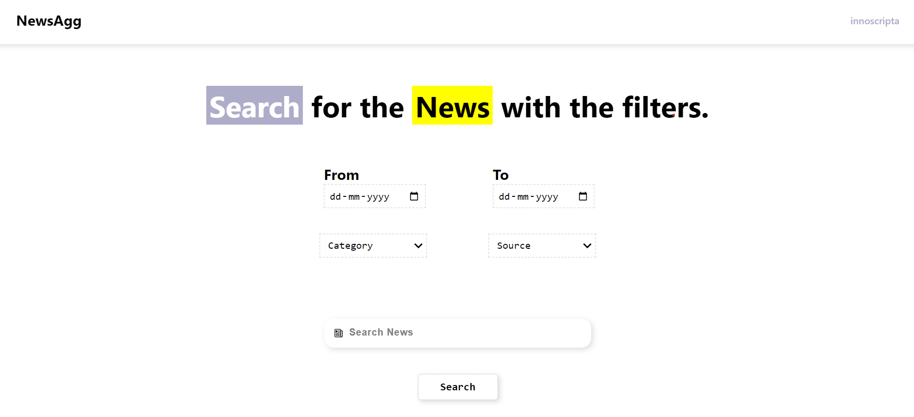

# innoscripta (News Aggregator Assessment)
<p align="center">
    
</p>
<br></br>
<p align="center">
    
</p>
<br></br>
<p align="center">
    
</p>

## Dependencies
- NPM
- Docker

## To build
```
docker image build -t news_aggregator:latest
```

## To run
```
docker run -p 3000:3000 news_aggregator
```
Now the site will be hosted on `http://localhost:3000`

## Features
- Search Bar: To search for the articles from the different sources (NewsAPI, The Guardian, New York Times).
- Feed: Which will show feeds/ headlines
- Filter: Filter can be used to personalize the search and the feed
